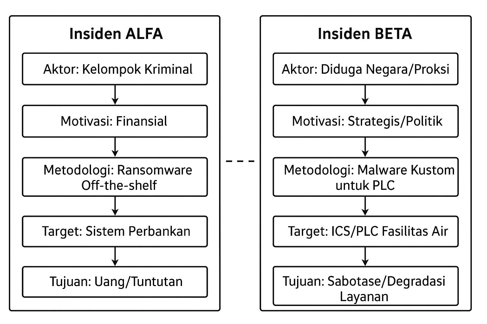
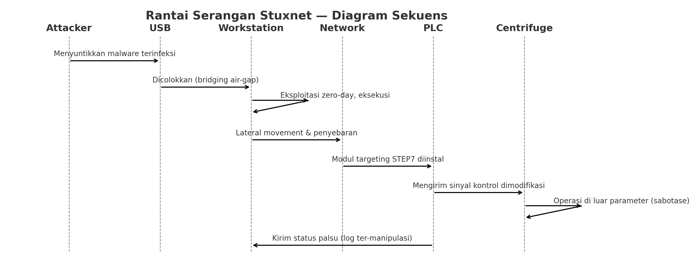
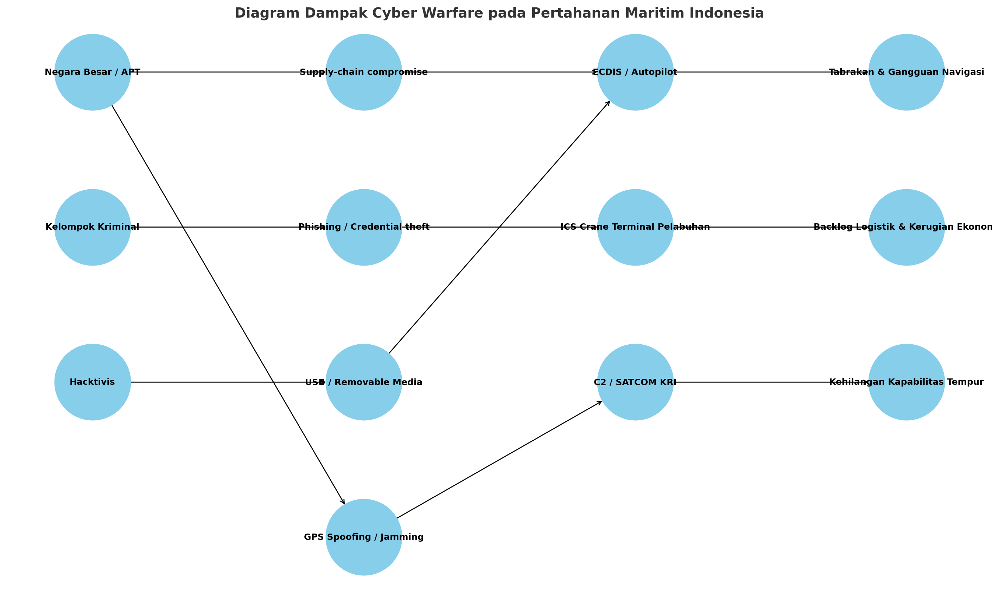

# Soal Latihan dan Tugas Analisis — Minggu 1-2

**Penulis:** Sertu TTG Marthen Frikaldo Antaribaba 

**Prodi:** Teknik Informatika (Pertahanan Siber)

**Tanggal:** 21 Oktober 2025

---

## Bagian A: Soal Latihan Pilihan Ganda & Esai Singkat

### I. Pilihan Ganda (Jawaban ditandai **(✓)**)

1. Menurut definisi yang disajikan dalam materi, elemen paling fundamental yang membedakan Cyber Warfare dari bentuk serangan siber lainnya adalah...

* a. Penggunaan malware yang canggih
* **b. Aktornya adalah negara-bangsa (atau proksi-nya)** **(✓)**
* c. Menargetkan infrastruktur digital
* d. Menyebabkan kerugian finansial yang besar

**Pembahasan singkat:** Cyber Warfare paling sering dibedakan oleh aktor negara atau aktor yang disponsori negara serta tujuan strategis/politik—bukan hanya profit atau vandalisme.

2. Pengakuan Cyberspace sebagai domain peperangan kelima berarti bahwa...

* a. Perang hanya akan terjadi di dunia maya.
* b. Semua negara wajib memiliki angkatan siber.
* **c. Aktivitas di ruang siber dapat dianggap setara dengan aksi militer di domain fisik.** **(✓)**
* d. Hukum perang tidak berlaku di internet.

**Pembahasan singkat:** Menetapkan cyberspace sebagai domain setara membuat operasi siber bisa dikategorikan sebagai tindakan militer berimplikasi hukum dan strategi.

3. Serangan yang menargetkan persepsi manusia, seperti kampanye disinformasi dan operasi psikologis (PSYOP), terjadi pada lapisan Cyberspace yang mana?

* a. Physical Layer
* b. Logical Layer
* **c. Cognitive Layer** **(✓)**
* d. Application Layer

**Pembahasan singkat:** Cognitive layer mencakup persepsi, informasi, dan pemrosesan manusia—tempat disinformasi dan PSYOP bekerja.

4. Peristiwa historis yang dianggap sebagai "titik balik" di mana serangan siber pertama kali berhasil melumpuhkan infrastruktur digital sebuah negara secara masif adalah...

* a. Morris Worm (1988)
* b. Moonlight Maze (1998)
* **c. Serangan Siber terhadap Estonia (2007)** **(✓)**
* d. Penemuan Stuxnet (2010)

**Pembahasan singkat:** Serangan DDoS 2007 terhadap Estonia melumpuhkan instansi pemerintahan dan bank secara nasional, menandai skala baru ancaman siber terhadap negara.

5. Tindakan proaktif yang diambil di luar jaringan sendiri untuk memproyeksikan kekuatan dan mencapai tujuan militer, seperti melakukan spionase atau melancarkan serangan, diklasifikasikan sebagai...

* a. Operasi Siber Defensif (DCO)
* **b. Operasi Siber Ofensif (OCO)** **(✓)**
* c. Operasi Informasi (IO)
* d. Jaminan Misi (Mission Assurance)

**Pembahasan singkat:** OCO mencakup tindakan ofensif yang bertujuan merusak, mengganggu, atau mempengaruhi target.

---

### II. Esai Singkat (2–4 kalimat masing-masing)

**1. Jelaskan dua karakteristik unik dari Cyberspace sebagai domain peperangan dan mengapa karakteristik tersebut mengubah sifat konflik modern!**

Cyberspace bersifat *borderless* dan cepat—serangan dapat diluncurkan dari mana saja dan berdampak seketika di seluruh dunia, sehingga respons tradisional yang berbasis wilayah menjadi kurang efektif. Selain itu, tingkat anonimitas dan plausible deniability memungkinkan aktor negara dan non-negara beroperasi dengan risiko geopolitik yang dikurangi, mengaburkan garis antara perang dan kriminalitas.

**2. Apa perbedaan fundamental antara motivasi di balik Cyber Warfare dan Cyber Crime? Berikan satu contoh untuk masing-masing.**

Motivasi Cyber Warfare umumnya strategis dan politis—mencapai tujuan nasional (mis. melemahkan sistem kontrol musuh untuk keuntungan militer). Contoh: serangan terarah untuk menonaktifkan sistem kendali logistik musuh. Cyber Crime didorong oleh keuntungan finansial atau dampak kriminal—mis. pencurian dana via ransomware. Contoh: kelompok kriminil mencuri uang dari perbankan nasional.

**3. Mengapa insiden Morris Worm pada tahun 1988 dianggap sebagai peristiwa penting dalam sejarah keamanan siber, meskipun tidak dirancang untuk tujuan jahat?**

Morris Worm menyebar cepat dan menyebabkan gangguan besar pada sistem akademik dan pemerintahan karena bug desain—menunjukkan bahwa perangkat lunak bisa menyebabkan kerusakan serius meski tidak berintent jahat. Insiden ini memicu diskusi hukum, etika, dan pengembangan program respons insiden (CERT).

**4. Dalam konteks Operasi Siber Militer, apa yang dimaksud dengan Mission Assurance dan mengapa hal ini menjadi tujuan utama dari Operasi Siber Defensif (DCO)?**

Mission Assurance adalah memastikan kemampuan kritis militer dan infrastruktur tetap tersedia, andal, dan aman untuk melaksanakan misi. DCO bertujuan mencegah, mendeteksi, dan memitigasi ancaman yang dapat mengganggu kemampuan operasional, sehingga kesiapan dan kontinuitas misi tetap terjaga.

**5. Jelaskan mengapa serangan Stuxnet dianggap sebagai momen "melintasi Rubicon" dalam sejarah cyber warfare!**

Stuxnet bukan hanya malware; ia dirancang untuk merusak peralatan fisik (sentrifugal) dengan presisi dan menyamarkan jejaknya, menunjukkan kemampuan negara untuk menggabungkan operasi siber dengan efek fisik yang terukur. Ini melampaui spionase tradisional dan memasuki ranah sabotase industri terarah—mengubah norma dan ambang keputusan untuk tindakan siber bersifat militer.

---

## Bagian B: Tugas Analisis dan Studi Kasus

### Tugas 1: Analisis Komparatif – Cyber Warfare vs. Cyber Crime

**Insiden**

* **ALFA:** Perbankan nasional dirampok—ransomware dibeli dari pasar gelap; operator dari Eropa Timur; motivasi finansial.
* **BETA:** Fasilitas pengolahan air mengalami malfungsi PLC—malware kustom, tidak ada ransom, terjadi di tengah ketegangan diplomatik.

#### Analisis per kriteria

| Kriteria     | Insiden ALFA                                   | Insiden BETA                                                     |
| ------------ | ---------------------------------------------- | ---------------------------------------------------------------- |
| Aktor        | Kelompok kriminal terorganisir (Eropa Timur)   | Diduga aktor negara atau proksi (tingkat kapabilitas tinggi)     |
| Motivasi     | Finansial (keuntungan langsung)                | Strategis/politik atau sabotase (non-finansial)                  |
| Target       | Sistem perbankan, data dan saldo nasabah       | Sistem kontrol industri (ICS/PLC) pada fasilitas kritis          |
| Metodologi   | Ransomware off-the-shelf, replay serangan umum | Malware kustom, rekayasa mendalam, reverse-engineered target PLC |
| Tujuan Akhir | Uang tebusan / pencucian uang                  | Gangguan operasional, degradasi layanan publik, tekanan politik  |

#### Klasifikasi dan Justifikasi

* **Insiden ALFA — Cyber Crime.** Justifikasi: Aktor dan motivasi finansial, penggunaan toolkit dari pasar gelap, serta pola operasional mirip tindakan kriminal terorganisir.
* **Insiden BETA — Kemungkinan Cyber Warfare (atau operasi yang disponsori negara).** Justifikasi: Malware kustom terarah tanpa tuntutan finansial, target infrastruktur kritis selama ketegangan diplomatik—mengindikasikan tujuan strategis bukan finansial.

#### Diagram Mermaid — Analisis Komparatif

### Tugas 2: Studi Kasus Mendalam – Anatomi Serangan Stuxnet

#### Fase Utama (Kill Chain) — Stuxnet

1. **Reconnaissance & Target Profiling**: Identifikasi vendor SCADA/PLC (Siemens) dan konfigurasi sentrifugal; memetakan perangkat lunak dan versi yang rentan.
2. **Delivery (Bridging the Air Gap)**: Penyebaran awal melalui USB removable (infected USB flash drive) untuk menjangkau workstation yang terisolasi.
3. **Exploitation**: Memanfaatkan beberapa zero-day Windows untuk eskalasi hak dan eksekusi kode.
4. **Installation & Lateral Movement**: Menyebar ke jaringan lokal dan memasang modul yang menargetkan software PLC (STEP7).
5. **Command & Control / Target Recognition**: Memverifikasi keberadaan target (PLC dan konfigurasi sentrifugal) sebelum aktivasi; menghindari deteksi dengan fingerprinting.
6. **Actions on Objectives (Sabotage)**: Mengubah frekuensi/pulse yang dikirim ke PLC sehingga sentrifugal berputar pada kondisi yang merusak (sabotase fisik).
7. **Covering Tracks**: Memanipulasi logging dan mengirimkan sinyal palsu ke monitoring sehingga operator melihat kondisi normal.

#### Dua Mekanisme Kunci

* **Sabotase fisik:** Modifikasi logika PLC sehingga peralatan industri (sentrifugal) beroperasi di luar parameter aman, menyebabkan kerusakan fisik.
* **Penipuan/Penyamaran:** Menyembunyikan perubahan melalui manipulasi data diagnostik dan log, serta pemicu kondisi tertentu sebelum aktivasi untuk menghindari deteksi awal.

#### Diagram Sekuens Mermaid — Rantai Serangan Stuxnet

### Tugas 3: Analisis Kontekstual – Dampak Cyber Warfare pada Pertahanan Maritim Indonesia

#### Tiga Sistem/Aset Yang Paling Rentan & Kritis

1. **Sistem Navigasi dan Autopilot Kapal (ECDIS / INS autopilot pada KRI & Kapal Komersial)**
2. **Sistem Kontrol Terminal Pelabuhan (Port Terminal Operating System & ICS di crane/pemindah kontainer)**
3. **Sistem Komunikasi dan Komando KRI (C2 / SATCOM / Link-data pertempuran)**

Untuk setiap sistem: skenario, vektor, dan konsekuensi:

**1) ECDIS / Autopilot (KRI & Kapal Komersial)**

* *Skenario serangan:* Aktor menyusup ke pembaruan peta digital yang dipalsukan atau memanfaatkan kerentanan firmware autopilot, mengarahkan kapal ke rute salah atau zona berbahaya.
* *Vektor:* Pembaruan peta berbahaya via USB, exploit firmware, supply-chain compromise.
* *Konsekuensi strategis:* Tabrakan, gangguan jalur pelayaran, gangguan logistik nasional, potensi korban jiwa, dan hilangnya kepercayaan pada rute strategis.

**2) Sistem Kontrol Terminal Pelabuhan (Crane ICS)**

* *Skenario serangan:* Malware mengendalikan crane sehingga kontainer salah alokasi atau infrastruktur pelabuhan macet.
* *Vektor:* Phishing ke operator, compromise VPN/remote access, exploit ICS khusus.
* *Konsekuensi strategis:* Terhambatnya impor/ekspor, kerugian ekonomi besar, backlog logistik nasional, dan ancaman keamanan rantai suplai.

**3) Sistem Komunikasi & C2 KRI (SATCOM / Link-data)**

* *Skenario serangan:* Interferensi atau spoofing data komando sehingga kapal menerima perintah palsu atau kehilangan kemampuan berbagi intelijen real-time.
* *Vektor:* Jamming, spoofing GPS, compromise pada ground station SATCOM, supply-chain malware pada perangkat komunikasi.
* *Konsekuensi strategis:* Kelemahan koordinasi tempur, blind-spot pada situasi taktis, peningkatan risiko kesalahan operasi, dan potensi eksploitasi oleh lawan selama krisis.

#### Diagram Mermaid — Analisis Dampak Maritim

---

**Selesai.**
